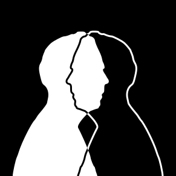
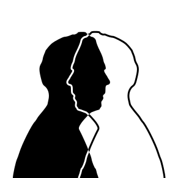

<!--
$theme: gaia
footer: CMPE/CSCI 1370 - 01 
-->

# Computer Science I
#### CMPE/CSCI 1370 - 01 

MW 9:25 am - 10:40 am
 
 
 
### http://bit.ly/votingcards

---

# JJ Lumagbas

jedaiah.lumagbas@utrgv.edu

---

# Peer-instruction

### Think - Pair - Share

---

Me:

#### A. Not from around here
#### B. Have a BS and Masters
#### C. Currently working on PhD
#### D. Worked as full time programmer for 4 years
#### E. Taught at university-level since 2008

---

Me:

#### A. Not from around here
#### B. Have a BS and Masters
#### ~~C. Currently working on PhD~~
#### D. Worked as full time programmer for 4 years
#### E. Taught at university-level since 2008

---

Me:

#### A. Lived inside a church building til 18yo
#### B. Went skydiving with wife when son was 10mos
#### C. Has freedived to 25ft (no scuba gear!)
#### D. Worked as a barista in Melbourne, AU
#### E. Had eye poked repeatedly with a needle (not by accident)

---

What's your current major?

#### A. Computer Science
#### B. Computer Engineering
#### C. Other Engineering
#### D. Other Science
#### E. Other

---

How much programming experience do you have?

#### A. None
#### B. 3 months or less
#### C. 6 months or less
#### D. 1 year or less
#### E. More than a year

---

## What is a program?
## What is programming?	
## What is a programming language?

---

#### WHAT IS A PROGRAM?

---

#### WHAT IS A PROGRAM?

# Inputs -> Process -> Outputs

---

#### WHAT IS PROGRAMMING?

---

#### WHAT IS PROGRAMMING?

# Encoding information as data
# Listing instructions to operate on that data
# To produce a result

---

#### WHAT IS A PROGRAMMING LANGUAGE?

---

#### WHAT IS A PROGRAMMING LANGUAGE?	

Arbitrary set of words that represent:

# Data
# Operations
# Control structures

---

# 
# 

---

Write a program that converts a black and white image to its negative

---

#### WHAT IS PROGRAMMING?

1. Encoding information as data
2. Listing instructions to operate on that data
3. (To produce a result)

---

#### WHAT IS PROGRAMMING?

1. How do we represent a black and white image as data?
2. Which instructions and operations do we need to perform on that data?

---

# Project demos

---

# Syllabus highlights

### http://github.com/jjlumagbas/1370

---

## http://bit.ly/1370codenames

---

# Photo