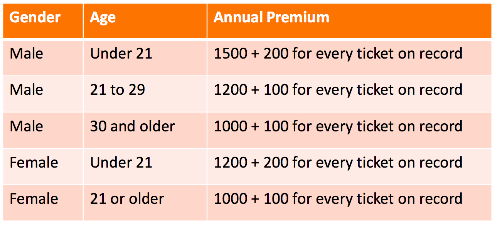
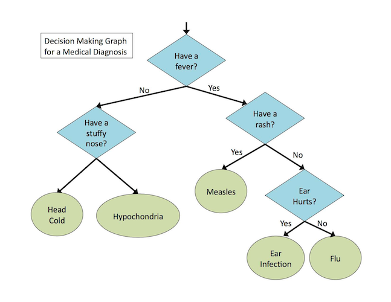

# 1370 Quiz 8: Functions with multiple parameters

<https://goo.gl/forms/yJzpRUQMoFNM6eiZ2>

Choose 3 functions below and attempt to define them. Paste your solutions into the Google form above. 

Note: as in all quizzes, getting the right answer isn't the most important thing. Rather, the quiz serves to help identify the gaps in your knowledge, and to generate questions we can go over during lecture. Do your best!

## `available?`

Design a function that returns true if Prof. Lumagbas is available for office hours, given the day of the week and hour of the day.

I'm available for office hours on Mondays-Thursdays, from 11am-1pm.

## `mix-colors`

Design a function that returns the name of the color produced when 2 given primary colors are mixed.

## `approve-transaction?`

Design a function that returns true when an attempted charge on a debit card is successful. An attempted charge is successful given that:

- the account is not suspended
- the total purchase price is less than the account balance

## `premium`

- Calculate insurance premium based on gender, age, and number of tickets on record

## `diagnosis`

- Diagnose a patient based on temperature, and whether or not he has either (or more) of: a stuffy nose, rashes, pain in the ear

